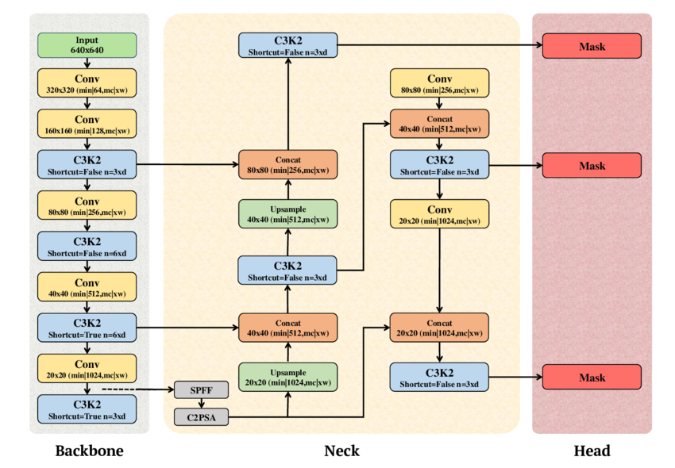

# Project Documentation: Box Detection in RGB Images using a YOLO Segmentation Model

## 1. Project Overview

This project focuses on training a computer vision model to accurately detect and localize bounding boxes of objects within RGB images. 


## 2. Prerequisites
1. Make sure your GPU driver is compatible with CUDA 12.4
1. Install the [NVidia Container Runtime](https://docs.nvidia.com/datacenter/cloud-native/container-toolkit/latest/install-guide.html)
3. Start the `docker-compose.yaml` and install dependencies with `uv sync` (or use VSCodes Dev Container extensions which does this automatically)


## 3. Data 
The [OSCD dataset](https://github.com/yancie-yjr/scd.github.io) was used for this project. Save the data to `/workspace/data/OSCD`.


## 5. Model & Training
### 5.1 Model Architecture
The `yolo11n-seg` model was used as a base model, which is a small model with a focus on real-time performance.

Image Source: Khan, Ameer Tamoor & Jensen, Signe. (2024). LEAF-Net: A Unified Framework for Leaf Extraction and Analysis in Multi-Crop Phenotyping Using YOLOv11. 10.21203/rs.3.rs-5582314/v1.

### 5.4 Augmentations
Aside from standard augmentations like Color Space and Geometric Augmentations, the `copy-paste` augmentation with mode `flip` was used to flip objects in their given contexts. Full augmentation configuration:

```
# Color Space Augmentations
hsv_h: 0.015 # Image hue
hsv_s: 0.7 # Image saturation
hsv_v: 0.4 # Image brightness

# Geometric Transformations
degrees: 10.0  # Image rotation
translate: 0.1  # Image translation
scale: 0.2  # Image scaling
shear: 2.0  # Image shearing
perspective: 0.0  # Warp image perspective
flipud: 0.1  # Flip image up-down
fliplr: 0.5  # Flip image left-right
mosaic: 1.0  # Mosaic from multiple images
close_mosaic: 10  # End mosaic augmentation early
mixup: 0.0  # Mix-up a new image by blending multiple source images
cutmix: 0.1  # Cut-mix an image by cutting together multiple source images
copy_paste: 0.2  # Create new image by copying existing objects
copy_paste_mode: "flip"  # Set the copy-paste mode
erasing: 0.0  # Delete parts of the image
auto_augment: None  # Don't apply auto augmentations

# Additional augmentations are run automatically, because albumentations is installed
# Blur(p=0.01, blur_limit=(3, 7))
# MedianBlur(p=0.01, blur_limit=(3, 7))
# ToGray(p=0.01, method='weighted_average', num_output_channels=3)
# CLAHE(p=0.01, clip_limit=(1.0, 4.0), tile_grid_size=(8, 8))
```

### 5.5 Epochs, Learning Rate and Loss Function
The model was trained for 300 epochs according to [YOLO docs](https://docs.ultralytics.com/guides/model-training-tips/#other-techniques-to-consider-when-handling-a-large-dataset). The learning rate was left at default 0.01 with a jump start at 0.1 for the first epochs. The loss function is a composite of box loss, class loss and segmentation loss functions.

## 6. Evaluation

The model is slightly overfitted. This is evident from the segmentation loss plot on the validation data. Better results would be possible with 150-200 epochs of training.


### 6.1 Validation samples


| net (46).jpg | net (92).jpg | net (27).jpg |
| :------------------: | :------------------: | :------------------: |
|  |  |  |


## 7. Reproduction
1. Save the [OSCD dataset](https://github.com/yancie-yjr/scd.github.io) to `/workspace/data/OSCD`.
2. Make sure you fulfill the requirements.
3. Run the training process through `training.ipynb`
4. Run the evaluation process through `evaluation.ipynb`
